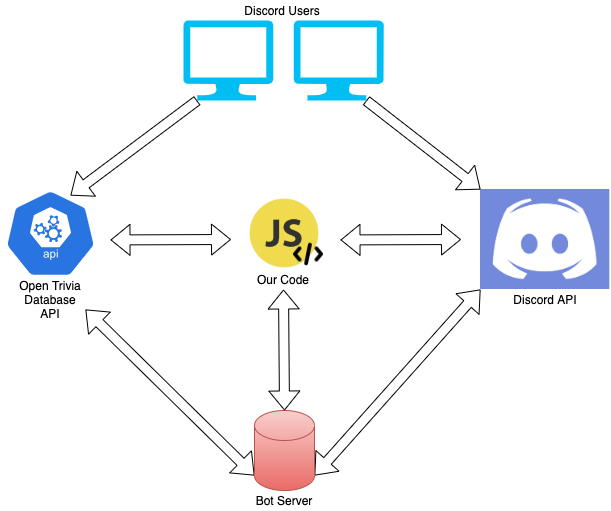

# Design Milestone

## Problem Statement

```
Remember, we are solving problems in the crowdsourcing market domain. This does not include problems, such as finding a parking spot, but it may include problems such as finding the most popular task, the most winning developer, finding the most complex/starving task, etc.

Most importantly, justify two questions: What is the problem? Why is it a problem?

This should be a good paragraph or two.
```

## Bot Description

```
What does your bot do? Why is a bot a good solution for the problem? Does your bot have a conversation with users (e.g. workers or task managers), provide analytical result for a specific inquiry, or does it just response to events (e.g., new registration/submission events)?

This should be a good two paragraphs.

Finally, devise a tagline for your bot, a simple phrase that captures the entire essence of the bot and your project.
```

## Use Cases

```
A use case is a way to describe a task that a user wants to perform and the required sequence of steps needed to accomplish that task. It may also include possible error states.

Based on your design, describe two use cases that describes the primary functionality of your bot.

This is an example use case:

Use Case: Browse open tasks

1 Preconditions

   None.

2 Main Flow

   User provides a current date in order to search  in the database for all tasks open on that day [S1]. Bot will display a list of task names for user to choose [S2]. Bot display detailed requirements of the task [S3].

3 Subflows

  [S1] User provides a data with a specific date format e.g. MM/DD/YYYY.

  [S2] Bot will return list of open tasks. User will make choice to check task details.

  [S3] Bot will display task details.

4 Alternative Flows

  [E1] No tasks are available on that day.

You can think of this as a set of conversations/interactions you want to be able to support with your bot.


```

## Design Sketches

```
- Create a  sequence flow or state transition mockup of your bot in action.
- Create a storyboard that illustrates the primary task that a user undergoes with bot.
```

## Architecture Design

```
- Create a diagram that illustrates the components of your bot, the platform it is embedded in, third party services it may use, data storage it may require, etc.
- Describe the architecture components in text.

This section should be several diagrams + paragraphs of text. This is the opportunity to really think through how you might build your system. Consider all the criteria listed here in your description. Generic architectures that do not properly reflect a solution will receive low scores.-
```

### Architecture Diagram



## Submission

Create a team repository for your bot, using the assigned github repository. Submit a link to your team repo. In your README.md, list all team members and their github ids. Add a DESIGN.md document (linked from README.md) with the following materials included.

## Deliverables

Problem Statement (15%)
Bot Description (10%)
Use Cases (15%)
Design Sketches (30%)
Architecture Design (30%)
